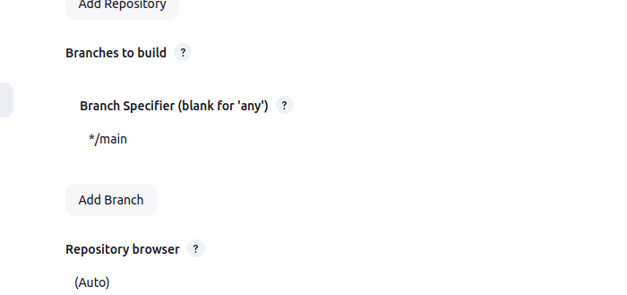

# Домашнее задание к занятию «Что такое DevOps. СI/СD» Шелухин Юрий

### Задание 1

**Что нужно сделать:**

1. Установите себе jenkins по инструкции из лекции или любым другим способом из официальной документации. Использовать Docker в этом задании нежелательно.
2. Установите на машину с jenkins [golang](https://golang.org/doc/install).
3. Используя свой аккаунт на GitHub, сделайте себе форк [репозитория](https://github.com/netology-code/sdvps-materials.git). В этом же репозитории находится [дополнительный материал для выполнения ДЗ](https://github.com/netology-code/sdvps-materials/blob/main/CICD/8.2-hw.md).
4. Создайте в jenkins Freestyle Project, подключите получившийся репозиторий к нему и произведите запуск тестов и сборку проекта ```go test .``` и  ```docker build .```.
В качестве ответа пришлите скриншоты с настройками проекта и результатами выполнения сборки.

---

## Решение 1
сделаем форк репозитория  
   
установим docker и go последних версий на обе (!) виртуальные машины  
скачаем архив с адреса https://go.dev/dl/  
удалим предыдущую версию  rm -rf /usr/local/go   
sudo tar -C /usr/local -xzf ~/Downloads/go1.24.2.linux-amd64.tar.gz  
export PATH=$PATH:/usr/local/go/bin  
проверим go version  
установим и запустим jenkins на ВМ с ip  192.168.65.134:  
установис java  
sudo (apt install default-jre (не работает!)) - apt-get install openjdk-17-jre (работает эта версия!!!)  
curl -fsSL https://pkg.jenkins.io/debian-stable/jenkins.io-2023.key | sudo tee /usr/share/keyrings/jenkins-keyring.asc > /dev/null
echo deb [signed-by=/usr/share/keyrings/jenkins-keyring.asc] https://pkg.jenkins.io/debian-stable binary/ | sudo tee /etc/apt/sources.list.d/jenkins.list > /dev/null  
sudo apt install jenkins  
добавим дженкинс в группу docker 
sudo usermod -aG docker jenkins  
проверим id jenkins  
разрешаем автозапуск systemctl enable jenkins  
разрешим docker передавать пакеты в формате http  
  
перезапустим docker sudo systemctl restart docker  
сделаем резолв  

откроем в браузере адрес 192.168.65.134:8080  
   
возьмем пароль в файле /var/lib/jenkins/secrets/initialAdminPassword  
установим и запустим nexus на ВМ с ip  192.168.65.132    
docker run -d -p 192.168.65.132:8081:8081 -p 192.168.65.132:8082:8082 --name nexus -e INSTALL4J_ADD_VM_PARAMS="-Xms512m -Xmx512m -XX:MaxDirectMemorySize=273m" sonatype/nexus3  
проверим sudo docker contaner ls --all  
выведем пароль администратора для первого логина в Nexus (для ip.....132)  
docker exec -t nexus bash -c 'cat /nexus-data/admin.password && echo'    
откроем на ВМ ...134 в браузере адрес 192.168.65.132:8081   Авторизуемся  
    
в jenkins:  
  create job  
  frestyle projekt, name my_pipe    
  
    
   
протестируем, исправим ошибки, получим на выходе:  
    
сборка произошла.  Настройка выгрузки в репозитории Nexus будет осуществлена в задании 2.  

---

### Задание 2

**Что нужно сделать:**  

1. Создайте новый проект pipeline.  
2. Перепишите сборку из задания 1 на declarative в виде кода.  

В качестве ответа пришлите скриншоты с настройками проекта и результатами выполнения сборки.  

---

## Решение 2  

1. создадим репозиторий в Nexus:  
img src = "img/2-0-1.png" width = 60%  
img src = "img/2-0-2.png" width = 60%  
внесем скрипт в pipeline jenkins:   
pipeline {  
 agent any  
 stages {  
  stage('Git') {  
   steps {git 'https://github.com/YuryShelukhin/  sdvps-materials.git'}  
  }  
  stage('Test') {  
   steps {  
    sh 'go test .'  
   }  
  }  
  stage('Build') {  
   steps {  
    sh 'docker build . -t ubuntu-bionic:8082/  hello-world:v$BUILD_NUMBER'  
   }  
  }  
  stage('Push') {  
   steps {  
    sh 'docker login ubuntu-bionic:8082 -u admin -p admin && docker push ubuntu-bionic:8082/  hello-world:v$BUILD_NUMBER && docker logout'   }  
  }  
 }  
}  
протестируем, исправим ошибки, получим на выходе:  
  
  
  
---

### Задание 3

**Что нужно сделать:**

1. Установите на машину Nexus.
2. Создайте raw-hosted репозиторий.
3. Измените pipeline так, чтобы вместо Docker-образа собирался бинарный go-файл. Команду можно скопировать из Dockerfile.
4. Загрузите файл в репозиторий с помощью jenkins.

В качестве ответа пришлите скриншоты с настройками проекта и результатами выполнения сборки.

## Решение 3  
внесем скрипт в pipeline jenkins:  
pipeline {  
 agent any  
 stages {  
  stage('Git') {  
   steps {git 'https://github.com/netology-code/sdvps-materials.git'}  
  }  
  stage('Test') {  
   steps {  
    sh 'go test .'  
   }  
  }  
  stage('Build') {  
   steps {  
    sh 'go build -a -installsuffix nocgo'  
   }  
  }  
  stage('Push') {  
   steps {  
    sh 'curl -u admin:admin http://192.168.65.132:8081/repository/Pipeline_3/ --upload-file ./sdvps-materials'  
   }  
  }  
 }  
}  
протестируем, исправим ошибки, получим на выходе:  
    
  
проверим выгрузку в депозиторий (raw) nexus:  
протестируем, исправим ошибки, получим на выходе:  
 
 
